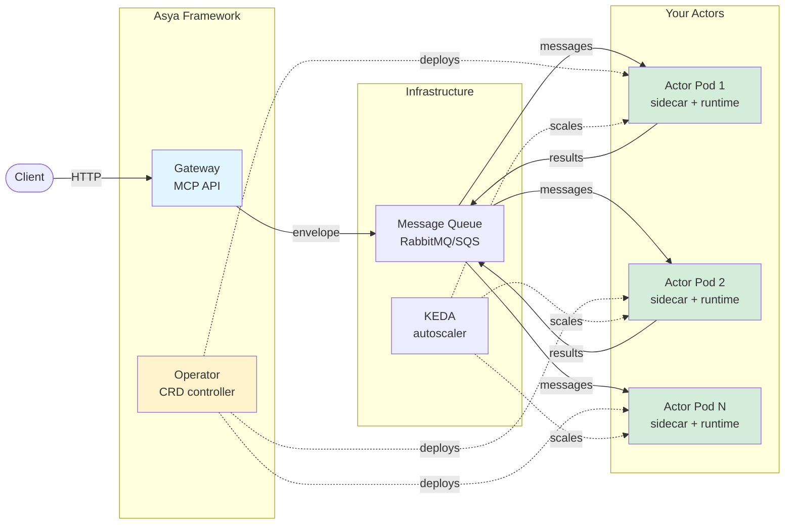

# Asya🎭
> *`/ˈɑːsjə/`, from Async Actors*
<!-- **Kubernetes-native async actor framework for AI/ML orchestration** -->

Asya🎭 is a **queue-based actor framework** for orchestrating AI/ML workloads on Kubernetes with:
- **Independent scaling**: Each actor scales 0→N based on its own queue depth
- **Zero infrastructure code**: Pure Python functions, no dependencies for queues/routing/retries
- **Dynamic pipelines**: Routes are data, not code - modify at runtime
- **Cost efficiency**: KEDA autoscaling from zero to max, pay only for active processing

**Core idea**: Write pure Python functions. Asya handles queues, routing, scaling, and monitoring.

<p align="left">
📘 <a href="docs/">Documentation</a> • 🚀 <a href="#quick-start">Quick Start</a> • 🏗️ <a href="docs/architecture/">Architecture</a> • 💡 <a href="docs/concepts.md">Concepts</a>
<br/><br/>

</p>

Battle-tested at [Delivery Hero](https://tech.deliveryhero.com/) for global-scale AI-powered image enhancement. Now powering LLM and agentic workflows.

---

---

## When to Use Asya🎭

### ✅ Ideal For

**Multi-step AI/ML pipelines**:
- Document processing (OCR → classification → extraction → storage)
- Image pipelines (resize → detect → classify → tag)
- LLM workflows (retrieval → prompt → generate → judge → refine)
- Video analysis (split → transcribe → summarize → translate)

**Event-driven workloads**:
- Webhook processing (GitHub, Stripe, Twilio events)
- Batch predictions (scheduled model inference)
- Async API backends (user uploads → background processing)

**Cost-sensitive deployments**:
- GPU inference (scale to zero between batches, avoid idle costs)
- Bursty traffic (10x scale-up for peak hours, zero off-peak)
- Dev/staging environments (minimize resource waste)

### ❌ Not Ideal For

- **Real-time inference < 100ms latency**: Queue overhead adds latency (use KServe/Seldon instead)
- **Training jobs**: Use Kubeflow, Ray Train, or native Kubernetes Jobs instead

**See**: [Motivation](docs/motivation.md) | [Core Concepts](docs/concepts.md) | [Use Cases](docs/motivation.md#use-cases)

---

## For Data Scientists

Write pure Python functions - no decorators, no DAGs, no infrastructure code:

```python
# handler.py
def process(payload: dict) -> dict:
    return {
        **payload,  # Keep existing data
        "result": my_model.predict(payload["input"])
    }
```

**Class handlers** for stateful initialization (model loading):

```python
class MyActor:
    def __init__(self, model_path: str = "/models/default"):
        self.model = load_model(model_path)  # Loaded once at pod startup

    def process(self, payload: dict) -> dict:
        return {
            **payload,
            "prediction": self.model.predict(payload["text"])
        }
```

**Envelope mode** for dynamic routing (agents, LLM judges):

```python
class LLMJudge:
    def __init__(self, threshold: float = 0.8):
        self.model = load_llm("/models/judge")
        self.threshold = float(threshold)

    def process(self, envelope: dict) -> dict:
        payload = envelope["payload"]
        score = self.model.judge(payload["llm_response"])
        payload["judge_score"] = score

        # Dynamically modify route based on LLM judge score
        route = envelope["route"]
        if score < self.threshold:
            route["actors"].insert(route["current"] + 1, "llm-refiner")

        route["current"] += 1
        return envelope
```

**Pattern**: Enrich payload with your results, pass it to next actor. Full pipeline history preserved.

**See**: [Quickstart for Data Scientists](docs/quickstart/for-data_scientists.md) | [Handler Examples](docs/quickstart/for-data_scientists.md#class-handler-examples)

---

## For Platform Engineers

Deploy actors via Kubernetes CRDs:

```yaml
apiVersion: asya.sh/v1alpha1
kind: AsyncActor
metadata:
  name: text-classifier
spec:
  transport: sqs  # or rabbitmq
  scaling:
    enabled: true
    minReplicas: 0
    maxReplicas: 100
    queueLength: 5  # Target: 5 messages per pod
  workload:
    kind: Deployment
    template:
      spec:
        containers:
        - name: asya-runtime
          image: my-classifier:latest
          env:
          - name: ASYA_HANDLER
            value: "classifier.TextClassifier.process"
          resources:
            limits:
              nvidia.com/gpu: 1
```

**What happens**:
1. Operator creates queue `asya-text-classifier`
2. Operator injects sidecar for message routing
3. KEDA monitors queue depth, scales 0→100 pods
4. Sidecar routes messages: Queue → Unix socket → Your code → Next queue

**Transports**: SQS (AWS), RabbitMQ (self-hosted), Kafka/NATS (planned)

**See**: [Quickstart for Platform Engineers](docs/quickstart/for-platform_engineers.md) | [Installation Guides](docs/install/) | [AsyncActor Examples](examples/asyas/)

---

## Quick Start

### Local Development (Kind cluster)

```bash
cd testing/e2e
export PROFILE=sqs-s3
make up             # Deploy full stack (~5 min)
make trigger-tests  # Run E2E tests
```

Includes: Asya operator, gateway, KEDA, RabbitMQ, MinIO, PostgreSQL, Prometheus, Grafana.

### Production (AWS EKS)

```bash
# 1. Install CRDs
kubectl apply -f src/asya-operator/config/crd/

# 2. Install operator
helm install asya-operator deploy/helm-charts/asya-operator/ \
  -n asya-system --create-namespace \
  -f operator-values.yaml

# 3. Deploy actors
kubectl apply -f examples/asyas/simple-actor.yaml
```

**See**: [AWS EKS Installation](docs/install/aws-eks.md) | [Local Kind Installation](docs/install/local-kind.md) | [Helm Charts](docs/install/helm-charts.md)

---

## Architecture



**Components**:
- **Operator**: Watches AsyncActor CRDs, injects sidecars, configures KEDA
- **Sidecar**: Handles queue consumption, routing, retries (Go)
- **Runtime**: Executes your Python handler via Unix socket
- **Gateway**: Optional MCP HTTP API for envelope submission and SSE streaming
- **Crew actors**: System actors (`happy-end`, `error-end`) for result persistence and error handling

**Message flow**: `Queue → Sidecar → Your Code → Sidecar → Next Queue`

**See**: [Architecture Documentation](docs/architecture/) | [Protocols](docs/architecture/protocols/) | [Components](docs/architecture/)

---

## Contributing

We welcome contributions! See [CONTRIBUTING.md](CONTRIBUTING.md) for:
- Development setup (Go, Python, Docker, Make)
- Testing workflow (unit, component, integration, E2E)
- Code standards and linting
- Pull request process

**Prerequisites**: Go 1.23+, Python 3.13+, Docker, Make, [uv](https://github.com/astral-sh/uv)

**Quick commands**:
```bash
make build              # Build all components
make test-unit          # Unit tests (Go + Python)
make test-integration   # Integration tests (Docker Compose)
make test-e2e           # E2E tests (Kind cluster)
make lint               # Linters with auto-fix
```

---

## License

Copyright © 2025 Delivery Hero SE

Licensed under the Apache License, Version 2.0. See [LICENSE](LICENSE) for details.

---

## Project Status

**Alpha software** under active development. APIs may change. Production use requires thorough testing.

**Current version**: v0.1.0

**Roadmap** (see [GitHub Discussions](https://github.com/deliveryhero/asya/discussions)):
- Stabilization and API refinement
- Additional transports (Kafka, NATS, Google Pub/Sub)
- Fast pod startup (PVC for model storage)
- Integrations: KAITO, Knative
- Enhanced observability (OpenTelemetry tracing)
- Multi-cluster routing

**Feedback**: Open an issue or discussion on [GitHub](https://github.com/deliveryhero/asya)
