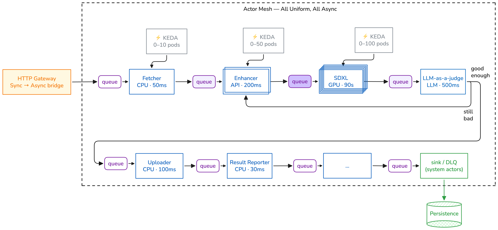

<p align="left">
  
  &nbsp;&nbsp;
  
</p>

[](https://github.com/deliveryhero/asya/actions/workflows/ci.yml)
[](https://opensource.org/licenses/Apache-2.0)
[](https://goreportcard.com/report/github.com/deliveryhero/asya)


[](https://artifacthub.io/packages/search?repo=asya)

**The Message Knows the Way.**

🎭 Asya is a Kubernetes-native **actor mesh** for async AI/ML pipelines. Each actor is a pure Python
function. Each message carries its own route. No central orchestrator. No SDK. No waiting.

---

## The Problem

AI workloads are **batch jobs** — bursty, GPU-heavy, multi-step. Forcing them into synchronous
REST patterns creates three problems:

1. **Wasted resources** — GPU pods sit idle between bursts; you pay for 24/7 what you need for minutes
2. **Cascading failures** — one slow step blocks the entire pipeline; retry logic is bolted on
3. **Tight coupling** — models, transports, and orchestration are tangled in application code

---

## How Asya Solves It

Write a pure Python function. Deploy it as a Kubernetes CRD. Asya handles the rest:

```python
# handler.py — your code, zero dependencies
def process(state: dict) -> dict:
    state["output"] = model.predict(state["input"])
    return state
```

```yaml
# actor.yaml — the platform's job
apiVersion: asya.sh/v1alpha1
kind: AsyncActor
metadata:
  name: my-model
spec:
  image: my-model:latest
  handler: handler.process
  scaling:
    minReplicas: 0
    maxReplicas: 50
```

**Two files, two owners**: data scientist owns the handler, platform team owns the spec.

<p align="center">
  
</p>
<p align="center"><em>Actors communicate through queues. Each message carries its own route.</em></p>

---

## Key Properties

- **Decentralized routing** — each envelope carries `prev/curr/next` queues; no coordinator to fail
- **Scale to zero** — KEDA watches each actor's queue independently; GPU pods cost nothing when idle
- **Pure Python handlers** — no SDK imports, no decorators; test with `assert process(payload) == expected`
- **Dynamic pipelines** — routes are data, not code; actors rewrite routing at runtime for agentic
  patterns, LLM judges, and branching flows
- **Multi-transport** — SQS, RabbitMQ, GCP Pub/Sub; switch without changing handler code
- **A2A + MCP gateway** — expose actor pipelines as A2A agents or MCP tools with streaming and pause/resume

---

## Get Started

```bash
helm repo add asya https://asya.sh/charts
helm repo update asya
helm install asya asya/asya-playground --namespace asya-demo --create-namespace
```

See the full [Quickstart Guide](docs/setup/start-quickstart.md) for cluster setup, verification,
and sending your first message.

---

## Documentation

| | |
|---|---|
| **[Setup](docs/setup/README.md)** | Install on Kind (local), EKS, or GKE |
| **[Usage](docs/usage/README.md)** | Write handlers, deploy actors, build flows |
| **[Concepts](docs/concepts/README.md)** | Envelope, actor, sidecar, routing — the core model |
| **[Architecture](docs/architecture.md)** | Components, protocols, data flow |
| **[Reference](docs/reference/README.md)** | Specs, config tables, API surfaces |
| **[Examples](examples/)** | Actor specs and Flow DSL teaser examples |
| **[Examples](examples/end-to-end/monorepo/)** | Full working examples by pattern category |

---

## Contributing

See [CONTRIBUTING.md](CONTRIBUTING.md). Prerequisites: Go 1.24+, Python 3.13+, Docker, Make.

---

## Status

Born from 3 years of production AI workloads at [Delivery Hero](https://tech.deliveryhero.com/). Open source and growing.

Apache 2.0 licensed. 🎭 **Maintainer**: Artem Yushkovskiy (`@atemate`)
