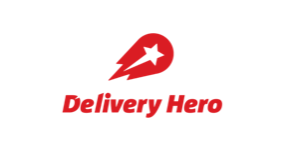

<p align="left">
  <picture>
    <source media="(prefers-color-scheme: dark)" srcset="./docs/img/logo_colored_with_borders.png">
    
  </picture>
  &nbsp;&nbsp;
  
</p>

**The Message Knows the Way.**

AI workloads don't belong behind synchronous REST APIs. They're batch jobs — bursty, GPU-heavy,
multi-step — and forcing them into request/response patterns adds latency, waste, and cascading failures.

Asya is a Kubernetes-native actor mesh for async AI/ML pipelines. Each actor is a pure Python function.
Each message carries its own route. No central orchestrator. No waiting.

```python
def process(payload: dict) -> dict:
    return {**payload, "result": model.predict(payload["input"])}
```

Deploy it as a Kubernetes CRD. Asya injects the sidecar, creates the queue, configures autoscaling.
Your code stays clean.

**Two files, two owners**: your handler (Python) + your actor spec (YAML). That's the entire interface.

---

## Why Asya

- **Decentralized routing** — envelopes carry `prev/curr/next` queues; no coordinator can fail
- **Scale to zero** — KEDA autoscales each actor independently from 0→N based on its own queue depth;
  GPU pods cost nothing when idle
- **Pure Python handlers** — no SDK imports, no decorators, no framework coupling; test locally with
  `assert process(payload) == expected`
- **Dynamic pipelines** — routes are data embedded in each message, not code; actors can rewrite
  routing at runtime for agentic patterns, LLM judges, branching flows

---

## Documentation

| | |
|---|---|
| **[Setup](docs/quickstart/README.md)** | Install on Kind (local) or your cluster — start here |
| **[Usage](docs/quickstart/usage.md)** | Write handlers, deploy actors, build flows with the Flow DSL |
| **[Concepts](docs/concepts.md)** | Envelope, actor, sidecar, routing — the core model |
| **[Motivation](docs/motivation.md)** | Why async actors beat synchronous REST for AI at scale |
| **[Architecture](docs/architecture/README.md)** | Components, protocols, data flow |
| **[Operate](docs/operate/)** | Monitoring, scaling, troubleshooting, upgrades |
| **[Examples](examples/)** | Actor specs and flow DSL examples |

---

## Contributing

**Prerequisites**: Go 1.24+, Python 3.13+, Docker, Make, [uv](https://github.com/astral-sh/uv)

```bash
make setup          # Install hooks, sync deps
make build          # Build all components
make test-unit      # Unit tests
make lint           # Linters with auto-fix
```

See [CONTRIBUTING.md](CONTRIBUTING.md) for the full development and testing guide.

---

## Status

Alpha. APIs may change. Battle-tested at [Delivery Hero](https://tech.deliveryhero.com/) for
global-scale AI image enhancement. Now powering LLM and agentic workflows.

Apache 2.0 licensed. **Maintainer**: Artem Yushkovskiy (`@atemate`)

Logo by [Alexandra Lalenko](mailto:alexandra.lalenko@gmail.com).
