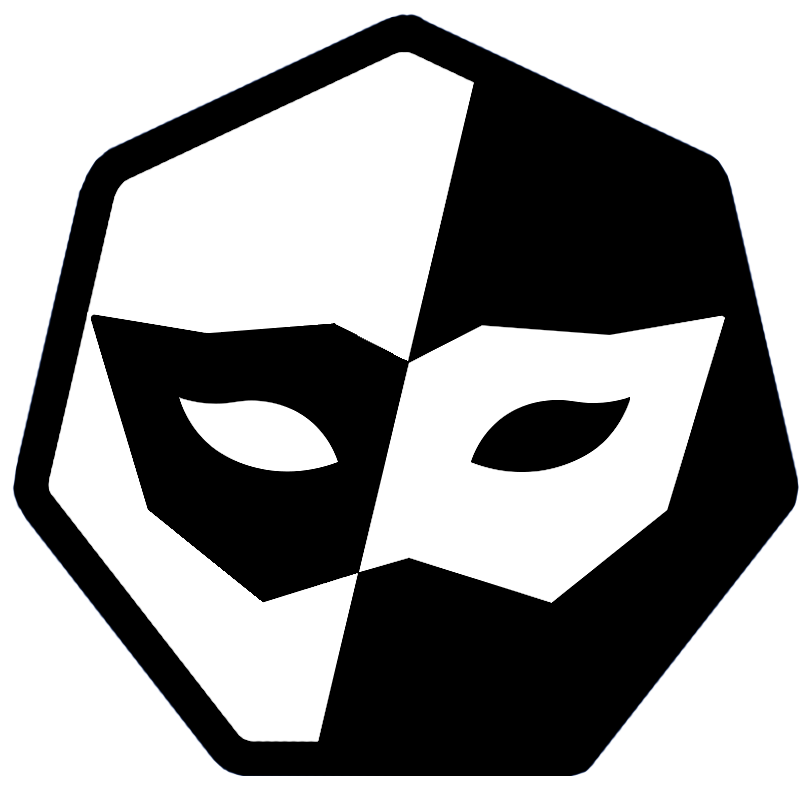
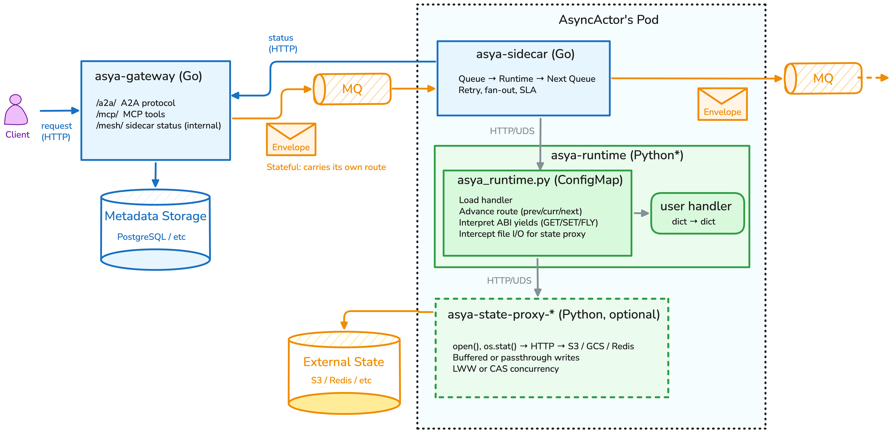

<p align="left">
  <picture>
    <source media="(prefers-color-scheme: dark)" srcset="./docs/website/img/logo_colored_with_borders.png">
    
  </picture>
  &nbsp;&nbsp;
  
</p>

[](https://github.com/deliveryhero/asya/actions/workflows/ci.yml)
[](https://opensource.org/licenses/Apache-2.0)
[](https://goreportcard.com/report/github.com/deliveryhero/asya)
[](https://github.com/deliveryhero/asya/releases/latest)

**The Message Knows the Way.**

AI workloads don't belong behind synchronous REST APIs. They're batch jobs — bursty, GPU-heavy,
multi-step — and forcing them into request/response patterns adds latency, waste, and cascading failures.

Asya is a Kubernetes-native actor mesh for async AI/ML pipelines. Each actor is a pure Python function.
Each message carries its own route. No central orchestrator. No waiting.

```python
def process(payload: dict) -> dict:
    return {**payload, "result": model.predict(payload["input"])}
```

Deploy it as a Kubernetes CRD. Asya injects the sidecar, creates the queue, configures autoscaling.
Your code stays clean.

**Two files, two owners**: your handler (Python) + your actor spec (YAML). That's the entire interface.

---

## Why Asya

- **Decentralized routing** — envelopes carry `prev/curr/next` queues; no coordinator can fail
- **Scale to zero** — KEDA autoscales each actor independently from 0→N based on its own queue depth;
  GPU pods cost nothing when idle
- **Pure Python handlers** — no SDK imports, no decorators, no framework coupling; test locally with
  `assert process(payload) == expected`
- **Dynamic pipelines** — routes are data embedded in each message, not code; actors can rewrite
  routing at runtime for agentic patterns, LLM judges, branching flows

---

## Architecture

<p align="center">
  
</p>
<p align="center"><em>Actor Mesh: each actor scales independently, messages carry their own route</em></p>

Each actor pod consists of your Python handler and an auto-injected sidecar that handles queue
polling, envelope routing, and delivery to the next actor in the pipeline:

<p align="center">
  
</p>
<p align="center"><em>Actor anatomy: sidecar + runtime inside a single pod</em></p>

---

## How Asya Compares

|                        | Asya | Argo Workflows | Temporal | LangGraph | Ray Serve |
|------------------------|:----:|:--------------:|:--------:|:---------:|:---------:|
| Scale to zero          |  ✅  |       ❌       |    ❌    |    ❌     |    ❌     |
| No SDK lock-in         |  ✅  |       ✅       |    ❌    |    ❌     |    ❌     |
| Dynamic routing        |  ✅  |       ❌       |    ✅    |    ✅     |    ❌     |
| K8s native (CRDs)      |  ✅  |       ✅       |    ❌    |    ❌     |    ❌     |
| Pure Python handlers   |  ✅  |       ❌       |    ❌    |    ❌     |    ❌     |

---

## Quick Start

**Prerequisites**: [Docker](https://docs.docker.com/get-started/) 24+,
[kubectl](https://kubernetes.io/docs/tasks/tools/) 1.28+,
[Helm](https://helm.sh/docs/intro/install/) 3.12+,
[Kind](https://kind.sigs.k8s.io/) 0.20+

### 1. Create a local cluster and install Crossplane

```bash
kind create cluster --name asya-quickstart

helm repo add crossplane-stable https://charts.crossplane.io/stable
helm repo update crossplane-stable
helm install crossplane crossplane-stable/crossplane \
  --namespace crossplane-system --create-namespace \
  --wait --timeout 180s
```

### 2. Install the playground (batteries included)

```bash
helm repo add asya https://asya.sh/charts
helm repo update asya

# Phase 1 — infrastructure
helm install asya asya/asya-playground \
  --namespace asya-demo --create-namespace \
  --set global.transport=sqs \
  --set global.storage=s3 \
  --timeout 600s --wait

# Phase 2 — wait for providers, then enable actors
kubectl wait --for=condition=Healthy \
  providers/provider-aws-sqs providers/provider-kubernetes \
  functions/function-go-templating functions/function-patch-and-transform functions/function-auto-ready \
  --timeout=300s
kubectl wait --for=condition=Established xrd/xasyncactors.asya.sh --timeout=120s

helm upgrade asya asya/asya-playground --namespace asya-demo \
  --reuse-values \
  --set asya-crossplane.providerConfigs.install=true \
  --set enableAsyaCrew=true \
  --set helloActor.enabled=true \
  --timeout 300s --wait
```

### 3. Send your first message

```bash
kubectl run aws-cli --rm -i --restart=Never --image=amazon/aws-cli \
  --namespace asya-demo \
  --env="AWS_ACCESS_KEY_ID=test" \
  --env="AWS_SECRET_ACCESS_KEY=test" \
  --env="AWS_DEFAULT_REGION=us-east-1" \
  --command -- sh -c "
    aws sqs send-message \
      --endpoint-url=http://localstack-sqs.asya-demo:4566 \
      --queue-url http://localstack-sqs.asya-demo:4566/000000000000/asya-asya-demo-hello \
      --message-body '{\"id\":\"test-1\",\"route\":{\"prev\":[],\"curr\":\"hello\",\"next\":[]},\"headers\":{},\"payload\":{\"name\":\"Asya\"}}'
  "
```

KEDA detects the message, scales the hello actor from 0 to 1 (~30s), processes it, and routes the
result to `x-sink`. After the cooldown period the actor scales back to zero.

> **Full walkthrough**: [Quickstart Guide](docs/setup/start-quickstart.md) — includes verification
> steps, log inspection, and troubleshooting.

---

## Documentation

| | |
|---|---|
| **[Setup](docs/setup/README.md)** | Install on Kind (local) or your cluster — start here |
| **[Usage](docs/usage/README.md)** | Write handlers, deploy actors, build flows with the Flow DSL |
| **[Concepts](docs/concepts.md)** | Envelope, actor, sidecar, routing — the core model |
| **[Motivation](docs/motivation.md)** | Why async actors beat synchronous REST for AI at scale |
| **[Architecture](docs/architecture.md)** | Components, protocols, data flow |
| **[Reference](docs/reference/README.md)** | Specs, configuration tables, API surfaces |
| **[Examples](examples/)** | Actor specs and flow DSL examples |

---

## Contributing

**Prerequisites**: Go 1.24+, Python 3.13+, Docker, Make, [uv](https://github.com/astral-sh/uv)

```bash
make setup          # Install hooks, sync deps
make build          # Build all components
make test-unit      # Unit tests
make lint           # Linters with auto-fix
```

See [CONTRIBUTING.md](CONTRIBUTING.md) for the full development and testing guide.

---

## Status

Alpha. APIs may change. Battle-tested at [Delivery Hero](https://tech.deliveryhero.com/) for
global-scale AI image enhancement. Now powering LLM and agentic workflows.

Apache 2.0 licensed. **Maintainer**: Artem Yushkovskiy (`@atemate`)
