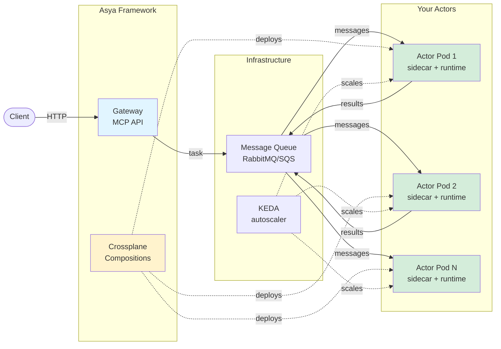

# Architecture Overview

Asya is a Kubernetes-native async actor framework with pluggable components for AI/ML orchestration.

## System Architecture

## Core Components

### Framework Components

- **[Crossplane Compositions](reference/components/core-crossplane.md)**: Declarative infrastructure compositions that create AsyncActor workloads, queues, render the sidecar inline, and configure KEDA autoscaling
- **[Gateway](reference/components/core-gateway.md)**: Optional MCP/A2A HTTP gateway for task submission, SSE streaming, and status tracking
- **[CLI](reference/components/lab-cli.md)**: Command-line tool for interacting with the gateway (MCP client)

### Actor Components

Each actor pod contains two containers:

- **[Sidecar](reference/components/core-sidecar.md)**: Handles queue consumption, message routing, retries, progress reporting (Go)
- **[Runtime](reference/components/core-runtime.md)**: Executes your Python handler via Unix socket, handles OOM recovery (Python)

### System Actors

- **[Crew Actors](reference/components/core-crew.md)**: Special actors with reserved roles (`x-sink`, `x-sump`, `x-pause`, `x-resume`) for result persistence, error handling, and human-in-the-loop

### Infrastructure

- **[Message Queues](reference/transports/README.md)**: Pluggable transports (SQS, RabbitMQ, GCP Pub/Sub)
- **[KEDA](setup/guide-autoscaling.md)**: Monitors queue depth, scales actors 0-N based on workload
- **[Observability](setup/ops-observability.md)**: Prometheus metrics, structured logging

## Sync Gateway

The gateway bridges the synchronous HTTP world with the asynchronous actor mesh. It operates in two deployment modes:

- **api mode** (`asya-gateway-api`): Handles external-facing A2A and MCP protocol endpoints. Clients submit tasks and receive results via blocking wait or SSE streaming.
- **mesh mode** (`asya-gateway-mesh`): Handles internal mesh callbacks from sidecars — progress updates, FLY events, final results. Unreachable externally by network topology.

Both modes share the same PostgreSQL database for task state. The gateway translates between synchronous HTTP semantics and the fire-and-forget nature of the queue-based mesh.

## Message Flow

1. **Client** sends request to Gateway (or directly to queue)
2. **Gateway** creates task, routes to first actor's queue
3. **Sidecar** consumes message from queue
4. **Sidecar** forwards message to Runtime via Unix socket
5. **Runtime** executes your Python handler, returns result
6. **Sidecar** routes result to next actor's queue (or `x-sink`/`x-sump`)
7. Repeat steps 3-6 for each actor in the route
8. **Crew actor** (`x-sink` or `x-sump`) persists final result, reports status to gateway

**Key insight**: `Queue -> Sidecar -> Your Code -> Sidecar -> Next Queue`

## Actor Lifecycle

1. User creates AsyncActor CRD
2. Crossplane Composition reconciles:
   - Creates queue (`asya-{namespace}-{actor_name}`)
   - Creates Deployment with sidecar + runtime containers
   - Creates KEDA ScaledObject (if scaling enabled)
3. KEDA monitors queue depth, scales pods 0-N
4. Sidecar consumes messages, routes to runtime
5. Runtime executes handler, returns results
6. Sidecar routes results to next queue

## Protocols

- **[Envelope Spec](reference/specs/envelope.md)**: Message structure, routing, status tracking
- **[Sidecar-Runtime](reference/specs/sidecar-runtime.md)**: Unix socket communication, framing protocol, error handling
- **[Gateway API](reference/specs/gateway-api.md)**: Full HTTP API reference (A2A, MCP, mesh, OAuth)
- **[ABI Protocol](reference/specs/abi-protocol.md)**: Generator handler yield forms (GET, SET, DEL, FLY)

## Deployment Patterns

**AWS (SQS + S3)**:

- Crossplane creates SQS queues via AWS Provider
- Actors use IAM roles (IRSA/Pod Identity) for queue access
- Results stored in S3
- KEDA uses CloudWatch metrics

**Self-hosted (RabbitMQ + MinIO)**:

- Crossplane creates RabbitMQ queues via custom provider
- Actors use username/password from secrets
- Results stored in MinIO (S3-compatible)
- KEDA uses RabbitMQ API

**See**: Installation Guides ([AWS EKS](setup/start-aws-eks.md), [GCP GKE](setup/start-gcp-gke.md), [Local Kind](setup/start-quickstart.md)) for detailed deployment instructions.
