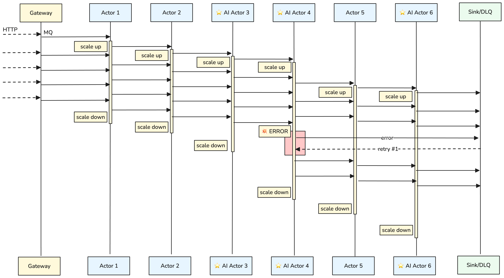

<!-- Type: Explanation -->
# Core Concepts

## Envelope

The envelope is the fundamental primitive in Asya. It is a JSON message that carries both the data and the route through the pipeline — "the message knows the way."

```json
{
  "id": "env-abc123",
  "route": {
    "prev": ["preprocess"],
    "curr": "infer",
    "next": ["postprocess", "store"]
  },
  "headers": { "trace_id": "t-42", "priority": "high" },
  "payload": { "text": "...", "cleaned": true }
}
```

**Fields**:
- `id` — unique identifier for tracking and deduplication
- `route.prev` — actors that have already processed this envelope (read-only)
- `route.curr` — the actor currently processing it (read-only)
- `route.next` — remaining actors in the pipeline (writable — actors can modify this for dynamic routing)
- `headers` — metadata like trace IDs, priorities
- `payload` — the user data flowing through the pipeline; each actor enriches it

After an actor processes an envelope, the sidecar advances the route: `curr` moves to `prev`, the first element of `next` becomes the new `curr`. The envelope then lands in the next actor's queue.

**See**: [actor-actor protocol](architecture/protocols/actor-actor.md) for the full envelope spec.



## Actor

An actor is a Kubernetes workload that processes one envelope at a time. You deploy it as an `AsyncActor` CRD:

```yaml
apiVersion: asya.sh/v1alpha1
kind: AsyncActor
metadata:
  name: infer
spec:
  image: my-model:latest
  handler: model.LLMHandler.process
  scaling:
    minReplicaCount: 0
    maxReplicaCount: 20
    queueLength: 5
```

Asya creates: one SQS queue + one Kubernetes Deployment (with sidecar injected) + one KEDA ScaledObject. Deleting the `AsyncActor` cascades to all three.

**Two files, two owners**: the handler (Python, written by the dev team) and the actor spec (YAML, managed by the platform team). These are decoupled — updating the scaling policy doesn't touch handler code, and changing the model doesn't touch infrastructure.

**See**: [architecture/asya-actor.md](architecture/asya-actor.md)

## Sidecar and Runtime

Every actor pod has two containers injected by Asya:

**Sidecar** (Go) handles all infrastructure concerns:
- Polls the SQS/RabbitMQ queue for envelopes
- Forwards envelope to the runtime via Unix socket
- Receives the result and routes it to the next queue
- Exposes Prometheus metrics, handles retries

**Runtime** (Python) handles all user-code concerns:
- Loads your handler class or function once at startup
- Executes it per envelope
- Returns the result to the sidecar

Your handler sees only `payload: dict → dict`. The envelope structure, queue mechanics, and routing are invisible to it.

**See**: [architecture/asya-sidecar.md](architecture/asya-sidecar.md), [architecture/asya-runtime.md](architecture/asya-runtime.md)


## Crew Actors

Crew actors are built-in system actors that handle framework-level concerns:

| Actor | Role |
|---|---|
| `x-sink` | Persists successful results to S3/MinIO; reports success to the gateway |
| `x-sump` | Receives envelopes that raised an exception; persists error details |
| `x-pause` | Checkpoints an envelope to S3 and signals `paused` (human-in-the-loop) |
| `x-resume` | Restores a checkpointed envelope and re-injects it into the mesh |

`x-sink` and `x-sump` are automatic — never include them in route configs. An empty `route.next` or a `None` return routes to `x-sink`. An unhandled exception routes to `x-sump`.

**See**: [architecture/asya-crew.md](architecture/asya-crew.md)

## Flow DSL

The Flow DSL lets you describe multi-actor pipelines in familiar Python control flow and compiles them into a set of router actors:

```python
def analysis_flow(p: dict) -> dict:
    p = clean_text(p)
    if p["language"] == "en":
        p = english_model(p)
    else:
        p = multilingual_model(p)
    p = store_result(p)
    return p
```

`asya flow compile analysis_flow.py` generates router actors that implement the branching logic as
message-passing actors at Kubernetes scale. **Python in, actors out.**

Flows only support actors with a 1:1 payload mapping (`return dict`). Dynamic routing (`yield "SET"`), fan-out, and `None` returns are actor-only features.

**See**: [reference/flow-dsl.md](reference/flow-dsl.md), [architecture/asya-flow.md](architecture/asya-flow.md)

## Gateway (Optional)

The gateway exposes actor pipelines as synchronous HTTP endpoints, MCP tools, or A2A agents. It bridges sync clients to the async mesh:

1. Client POSTs to `/mcp/call/my-pipeline`
2. Gateway creates a task, sends the envelope to the first actor's queue
3. Crew actors report progress back via `/mesh/` callbacks
4. Gateway streams updates to the client via SSE

**See**: [architecture/asya-gateway.md](architecture/asya-gateway.md)
