# Asya🎭 Architecture

Complete technical architecture documentation for the Asya🎭 async actor framework.

## Table of Contents
- [Motivation](#motivation) - Why async actors matter
- [Core Concept](#core-concept) - What makes Asya🎭 different
- [System Architecture](#system-architecture) - High-level components
- [Component Details](#component-details) - Deep dives into each component
- [Message Flow](#message-flow) - How envelopes move through the system
- [Scaling Architecture](#scaling-architecture) - KEDA autoscaling
- [Deployment Patterns](#deployment-patterns) - Different deployment configurations

## Motivation

### Architecture Evolution: From Synchronous HTTP to Async Actors

#### 1. Synchronous HTTP (Traditional)

The simplest approach, but problematic in production. Client makes sequential HTTP calls to each AI server and waits for each response before proceeding. Client is completely blocked during processing and must hold intermediate results in memory. Retry logic with exponential backoff makes latency unpredictable and compounds blocking time.


#### 2. Async Request-Response (Better, not perfect)

Client orchestrates the workflow by calling each AI server sequentially via message queues and waiting for responses. Client must keep state in memory between calls. If a server crashes during processing, the client waits indefinitely for a response that will never come. If the client crashes or restarts, all progress is lost.

```mermaid
sequenceDiagram
    participant C as Client<br/>
    participant S1 as AI Server 1<br/>(has MQ)
    participant S2 as AI Server 2<br/>(has MQ)

    Note over C,S2: Async Request-Response (Better)
    activate C
    C->>S1: Request 1
    activate S1
    S1->>S1: Process
    S1-->>C: Response 1
    deactivate S1
    Note right of C: Store result<br/>in memory
    C->>S2: Request 2 (with result 1)
    activate S2
    S2->>S2: Processing...
    Note right of S2: Server crashes!
    S2--xS2: Crash
    deactivate S2
    Note right of C: Waiting indefinitely<br/>for response...<br/>(timeout?)
    deactivate C
    Note over C,S2: ✅ Client not blocked initially<br/>⚠️ Infinite wait on server crash<br/>⚠️ Client holds state in memory<br/>⚠️ Progress lost on crash
```



#### 3. Async Actors (Asya🎭 - Best)

Fully decoupled architecture via message queues. Each actor has its own queue and processes independently, scaling based on queue depth. MCP-compliant gateway provides SSE streaming for real-time status updates. No idle waiting, automatic retries, and actors can scale to zero when not needed. This is the Asya🎭 approach.


**Key improvements with async actors**:
- **Decoupling**: Each actor is independent, no direct dependencies between services
- **Resilience**: Queue-based processing with automatic retries and dead-letter handling
- **Scalability**: KEDA scales each actor independently based on queue depth
- **Cost efficiency**: Actors scale to zero when idle, no wasted resources
- **Flexibility**: Easy to add/remove/reorder actors without changing code

## Core Concepts

Asya🎭 breaks complex AI pipelines into **specialized, stateless, independent actors**. Each processing actor (data ingestion, prompt construction, model inference, post-processing) runs as an independent actor that:
- Scales from zero to N replicas based on queue depth (KEDA)
- Communicates via message queues (RabbitMQ, SQS)
- Deploys declaratively with Kubernetes CRDs

**The sidecar pattern**: Each actor pod = Go sidecar (handles queues, routing) + your runtime (AI processing logic) communicating via Unix socket. Operator injects sidecars automatically.

**Benefits**:
- **Scale-to-zero**: Pay only for active processing
- **Composability**: Mix and match actors, reuse across pipelines
- **Independent scaling**: Each actor scales based on its own queue depth
- **Simple development**: Write `process(payload)` functions, framework handles infrastructure

**Design rationale**: See [design-rationale.md](design-rationale.md) for detailed explanation of why sidecar pattern and async communication.

## System Architecture

Asya🎭 is composed of four main components that work together to provide an actor-based framework for AI workloads:

```
┌─────────────────────────────────────────────────────────────────┐
│                         Kubernetes Cluster                      │
│                                                                 │
│  ┌────────────────────────────────────────────────────────────┐ │
│  │                    Asya🎭 Operator (asya-system)           │ │
│  │  Watches AsyncActor CRDs → Creates Workload with Sidecar   │ │
│  └────────────────────────────────────────────────────────────┘ │
│                              │                                  │
│                              ▼                                  │
│  ┌────────────────────────────────────────────────────────────┐ │
│  │                 Asya🎭 AsyncActor - CRD                    │ │
│  │                                                            │ │
│  │  ┌──────────────┐         ┌────────────────────────┐       │ │
│  │  │   Sidecar    │◄───────►│   Runtime Container    │       │ │
│  │  │   (Go)       │  Unix   │   (Your AI App)        │       │ │
│  │  │              │  Socket └──────────▲─────────────┘       │ │
│  │  └──────▲───────┘           ┌────────┼──────────┐          │ │
│  │         │        ConfigMap: │  asya_runtime.py  │          │ │
│  │         │                   └───────────────────┘          │ │
│  └─────────┼──────────────────────────────────────────────────┘ │
│            │                                                    │
│  ┌─────────┼───────┐┌───────────────────────────────────────┐   │
│  │ Required│infra  ││ Asya🎭 MCP Gateway infrastructure       │   │
│  │  ┌──────┴──────┐││ ┌──────────────┐ ┌──────────────────┐ │   │
│  │  │  Message    │││ │ PostgreSQL   │ │  Prometheus +    │ │   │
│  │  │  Queue      │││ │ (Envelopes)  │ │  Grafana         │ │   │
│  │  └─────▲───────┘││ └─────▲────────┘ └──────────────────┘ │   │
│  └────────┼────────┘└───────┼───────────────────────────────┘   │
│           │                 │                                   │
│  ┌────────┼─────────────────┼─────────────────────────────────┐ │
│  │                Asya🎭 MCP Gateway (optional)                 │ │
│  │  MCP Protocol → Envelope Management → Queue → Streaming    │ │
│  └────────────────────────────────────────────────────────────┘ │
│                             ▲                                   │
└─────────────────────────────┼───────────────────────────────────┘
                              │
                              │
                      MCP Client (HTTP)
```

## Component Details

### 1. Asya🎭 Operator

**Location**: `src/asya-operator/`
**Language**: Go (Kubebuilder-based)

The operator is a Kubernetes controller that:
- Watches `AsyncActor` custom resources
- Automatically injects sidecar containers
- Creates Deployments, StatefulSets, or Jobs
- Configures KEDA ScaledObjects for autoscaling
- Manages RBAC, ServiceAccounts, and Secrets

See [asya-operator.md](asya-operator.md) for details.

### 2. Asya🎭 Sidecar

**Location**: `src/asya-sidecar/`
**Language**: Go 1.23

The sidecar is a message router that:
- Consumes messages from message queues
- Communicates with runtime via Unix socket
- Routes responses to next queue in pipeline
- Handles errors and retries
- Exposes Prometheus metrics

See [asya-sidecar.md](asya-sidecar.md) for details.

### 3. Asya🎭 Runtime

**Location**: `src/asya-runtime/`
**Language**: Python 3.7+ (backward compatible)

The runtime is a Unix socket server that:
- Listens for payloads from sidecar
- Loads user-defined process functions
- Executes processing logic
- Returns results or errors
- Handles size limits and validation

See [asya-runtime.md](asya-runtime.md) for details.

### 4. Asya🎭 Gateway

**Location**: `src/asya-gateway/`
**Language**: Go 1.23

The gateway is an optional MCP server that:
- Implements JSON-RPC 2.0 protocol
- Creates and tracks envelopes
- Sends messages to actor queues
- Provides SSE streaming for envelope updates
- Persists envelope state in PostgreSQL

See [asya-gateway.md](asya-gateway.md) for details.

### 5. Asya🎭 Crew

**Location**: `src/asya-crew/`
**Language**: Python 3.13+

System actors with reserved roles:
- **happy-end**: Persists successful results to S3, reports final status to gateway
- **error-end**: Handles failures with exponential backoff retry logic and DLQ handling

Both are auto-routed by the sidecar and should never be configured explicitly in routes.

### 6. KEDA

**External dependency**: [KEDA](https://keda.sh/)

Event-driven autoscaler that:
- Monitors message queue depth
- Scales actors from 0 to N replicas
- Configures Horizontal Pod Autoscaler
- Supports multiple queue types (RabbitMQ, SQS)

See [scaling-keda.md](scaling-keda.md) for configuration details.

### 7. Transport Layer

**Location**: `src/asya-sidecar/internal/transport/`

Pluggable transport implementations:
- **RabbitMQ**: AMQP-based message broker
- **AWS SQS**: Managed queue service

See [transport.md](transport.md) for configuration details.

## Message Flow

### Standard Actor Pipeline (ASYA_HANDLER_MODE=payload)

```
1. Message arrives in queue
   ↓
2. Sidecar receives envelope
   │
   ├─ Extracts: id + route + payload + headers (optional)
   ↓
3. Sidecar sends payload to runtime via Unix socket
   ↓
4. Runtime processes payload
   │
   ├─ Success: Returns mutated payload
   ├─ Error: Returns error
   └─ Fan-out: Returns array of mutated payloads
   ↓
5. Runtime automatically increments route's current actor (if success)
   ↓
6. Sidecar routes based on response
   │
   ├─ Single result → Next actor in route
   ├─ Array → Each item to next actor
   ├─ Empty → happy-end queue
   └─ Error → error-end queue
   ↓
6. Sidecar ACKs original message
```

### With Gateway

```
1. Client sends MCP request to Gateway
   ↓
2. Gateway creates envelope (pending)
   ↓
3. Gateway sends envelope to first queue
   ↓
4. Actor processes (envelope becomes running)
   │
   ├─ Sidecar reports progress to Gateway via HTTP
   ↓
5. All actors in the route complete
   ↓
6. Envelope updated (succeeded/failed)
   ↓
7. Client receives result via SSE stream or polling
```

## Message Structure

All messages follow this format:

```json
{
  "id": "...",
  "route": {
    "actors": ["actor1", "actor2", "actor3"],
    "current": 0
  },
  "payload": <arbitrary JSON>,
  "headers": {
    // arbitrary key-value
  },
}
```

- **route.actors**: Pipeline of actor names
- **route.current**: Current actor index (auto-incremented)
- **payload**: Application data
- **headers**: Optional routing metadata

See [protocol-envelope.md](protocol-envelope.md) for detailed envelope routing and protocol specification.

## Scaling Architecture

### KEDA Integration

```
Queue Depth → KEDA Scaler → HPA → Pod Autoscaling
```

1. KEDA monitors queue depth
2. Compares to target (messages per replica)
3. Adjusts HPA desired replicas
4. Kubernetes scales pods up/down
5. Can scale to zero when idle

**Scaling Policies:**
- Scale up: 100% increase or +4 pods every 15s
- Scale down: 50% decrease every 15s
- Cooldown: 60s before scale to zero

### Horizontal Scaling

Each actor pod is independent:
- Stateless processing
- Shared queue consumption
- No coordination required
- Linear scalability

## Deployment Patterns

Asya🎭 supports flexible deployment configurations based on your requirements:

### Pattern 1: Minimal (CRD + Message Queue)
**Components**: Asya🎭 Operator + Message Queue + KEDA

Deploy actors directly via AsyncActor CRDs. Pure queue-driven compute with no envelope tracking or API layer.

**Ideal for**: Batch processing, background workloads, cost-sensitive deployments needing scale-to-zero

### Pattern 2: Standard (CRD + Gateway + Message Queue)
**Components**: Minimal + Gateway (MCP) + PostgreSQL

Add MCP Gateway for synchronous API access with envelope status tracking, SSE streaming, and state persistence.

**Ideal for**: Tool integration, envelope tracking, real-time updates

### Pattern 3: Full Stack (Standard + Monitoring)
**Components**: Standard + Prometheus + Grafana

Add observability with metrics dashboards, autoscaling visualization, and alerting.

**Ideal for**: Production deployments requiring visibility and monitoring

### Pattern 4: Multi-Cluster (Queue-Based Infinite Scale)
**Architecture**: Multiple Kubernetes clusters connected to shared message queue

Queue-based autoscaling enables out-of-the-box multi-cluster deployments. Actors in different regions consume from same queues, enabling cross-region workload distribution, geographic distribution, cloud bursting, and seamless scaling without reconfiguration.

**Example**: Deploy actors in `us-east-1`, `eu-west-1`, and `ap-south-1` clusters consuming from a single RabbitMQ instance. Workload distributes automatically based on available capacity.

## Storage Architecture

### Message Queue (RabbitMQ/SQS)

- **Topic Exchange**: Routes messages by queue name (RabbitMQ)
- **Durable Queues**: Survive broker restarts
- **Persistent Messages**: Survive broker restarts
- **Prefetch**: Control concurrent messages per consumer

### Database (PostgreSQL)

Used by Gateway for:
- **envelopes table**: Envelope metadata and state
- **envelope_updates table**: Audit log for SSE streaming
- **Migrations**: Sqitch-based schema evolution

### Object Storage (Optional)

MinIO or S3 for:
- Large payloads
- Model artifacts
- Training data
- Results storage

## Network Architecture

### Pod Communication

- **Sidecar ↔ Runtime**: Unix socket (`/tmp/sockets/app.sock`)
- **Sidecar ↔ Queue**: TCP (Message queue protocol)
- **Gateway ↔ Queue**: TCP (Message queue protocol)
- **Gateway ↔ Database**: TCP (PostgreSQL)

### External Access

- **Gateway**: LoadBalancer or Ingress (port 8080)
- **Grafana**: Port-forward or Ingress (port 3000)
- **Message Queue Management**: Port-forward (varies by implementation)

## Security Architecture

### Authentication

- **Message Queue**: Username/password via Secrets
- **PostgreSQL**: Username/password via Secrets
- **Gateway**: No auth (add reverse proxy for production)

### Authorization

- **RBAC**: ServiceAccounts with minimal permissions
- **Pod Security**: Non-root users where possible
- **Network Policies**: Optional isolation

### Secrets Management

- Kubernetes Secrets for credentials
- Environment variable injection
- Reference via secretKeyRef

## High Availability

### Component HA

- **Operator**: Single instance (leader election possible)
- **Gateway**: Stateless, can run multiple replicas
- **Actors**: Horizontal scaling via KEDA
- **Message Queue**: Can run clustered
- **PostgreSQL**: Can use managed service

### Failure Modes

- **Pod failure**: Kubernetes restarts
- **Node failure**: Pods rescheduled
- **Queue failure**: Messages persist, actors retry
- **Database failure**: Gateway degraded, actors continue

## Next Steps

### Component Documentation
- [Operator](asya-operator.md) - Kubernetes operator and CRD management
- [Sidecar](asya-sidecar.md) - Message routing and queue integration
- [Runtime](asya-runtime.md) - Handler execution and validation
- [Gateway](asya-gateway.md) - MCP protocol and envelope tracking
- [KEDA](scaling-keda.md) - Autoscaling configuration
- [Transport](transport.md) - Message queue implementations
- [Actor](asya-actor.md) - AsyncActor CRD specification

### Protocol Documentation
- [Envelope Protocol](protocol-envelope.md) - Message structure and routing
- [Sidecar-Runtime Protocol](protocol-unix-socket.md) - Unix socket communication
- [CRD API Reference](asya-operator.md#asyncactor-crd-api-reference) - AsyncActor specification
- [Metrics Reference](observability.md) - Prometheus metrics

### Design Documentation
- [Design Rationale](design-rationale.md) - Why sidecar and async?

### Getting Started
- [Concepts](../getting-started/02-concepts.md) - Core terminology
- [Installation](../getting-started/03-installation.md) - Setup guide
- [Quick Start](../getting-started/04-quickstart.md) - First deployment

### Guides
- [Development](../guides/development.md) - Local development workflow
- [Deployment](../guides/deploy.md) - Production deployment
- [Testing](../guides/testing.md) - Testing strategies
